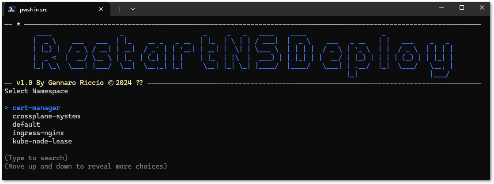
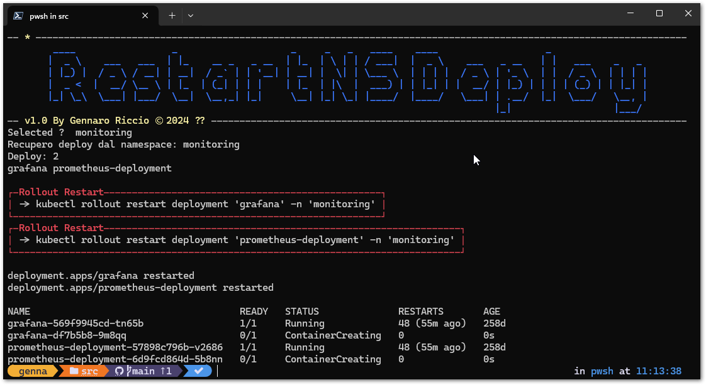

# Restart Namespace Deploy

If you need to automate the restart of a namespace deployment for whatever reason, this script helps you do so.

## Installation

Install prerequisites

#### Powershell v7+
#### PwshSpectreConsole
```powershell
   Install-Module PwshSpectreConsole -Scope CurrentUser  
```

## Documentation

Execute with select namespace:

```powershell
.\restart-namespace-deploy 
```


Execute with namespace:

```powershell
.\restart-namespace-deploy application-namespace
```


All namespace with filter:

.\restart-namespace-deploy.ps1 all

to filter namespace use file namespace_filter.txt

## Note
This is a small and simple utility using kubectl commands. Remember to use the correct context in the case of multi clusters

# 

[](https://choosealicense.com/licenses/mit/)


